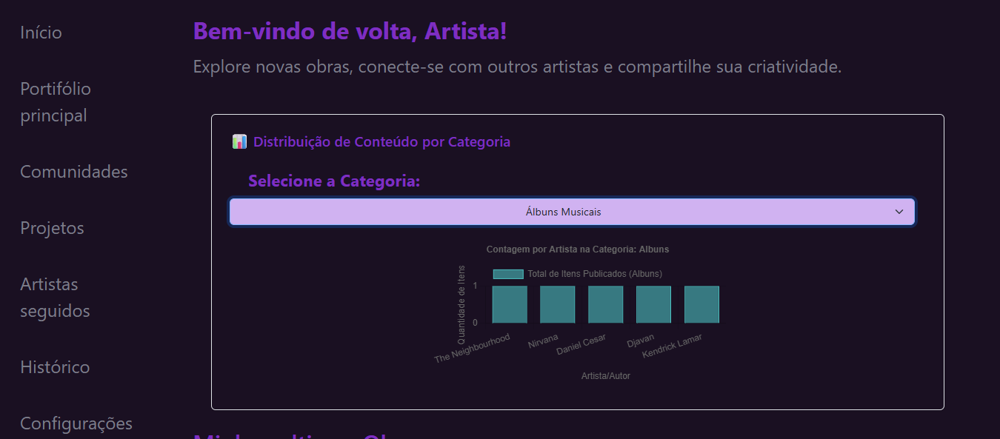
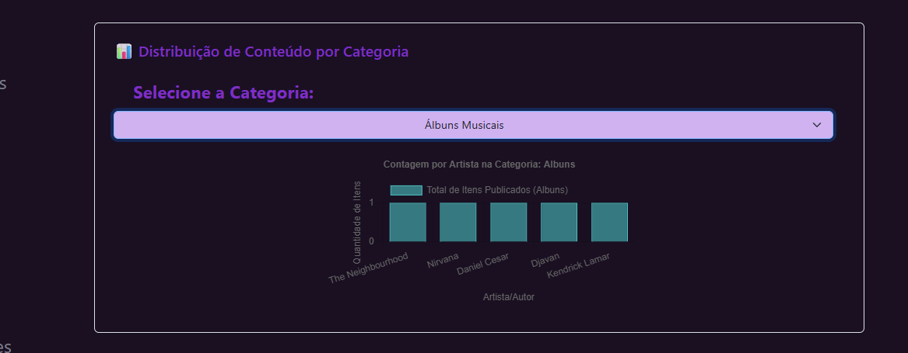
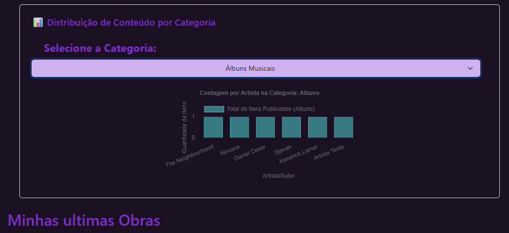

# Trabalho Prático 07 - Semanas 13 e 14

A partir dos dados cadastrados na etapa anterior, vamos trabalhar formas de apresentação que representem de forma clara e interativa as informações do seu projeto. Você poderá usar gráficos (barra, linha, pizza), mapas, calendários ou outras formas de visualização. Seu desafio é entregar uma página Web que organize, processe e exiba os dados de forma compreensível e esteticamente agradável.

Com base nos tipos de projetos escohidos, você deve propor **visualizações que estimulem a interpretação, agrupamento e exibição criativa dos dados**, trabalhando tanto a lógica quanto o design da aplicação.

Sugerimos o uso das seguintes ferramentas acessíveis: [FullCalendar](https://fullcalendar.io/), [Chart.js](https://www.chartjs.org/), [Mapbox](https://docs.mapbox.com/api/), para citar algumas.

## Informações do trabalho

- Nome: Erica Regina da Silva Martins
- Matricula: 00905541
- Proposta de projeto escolhida: Pessoas e produções
- Breve descrição sobre seu projeto: Meu projeto é criar uma rede que sirva de portifolio online para artistas, viabilizar a criação de comunidades para a disseminação de diferentes formas de arte, epor meio de recomendações das comunidades disseminar curiosidades sobre obras de artistas famosos, vivos ou não. Além disso, por meio do compartilhamento de albuns de musicas, garantir a identificação de gostos em comum.

**Print da tela com a implementação**

<< Eu implementei um gráfico que analisa quantidade de postagens por categoria, por exemplo: na categoria de albuns musicais favoritos tem um album do artista Djavan postado >>

<<   >>

<< >>
